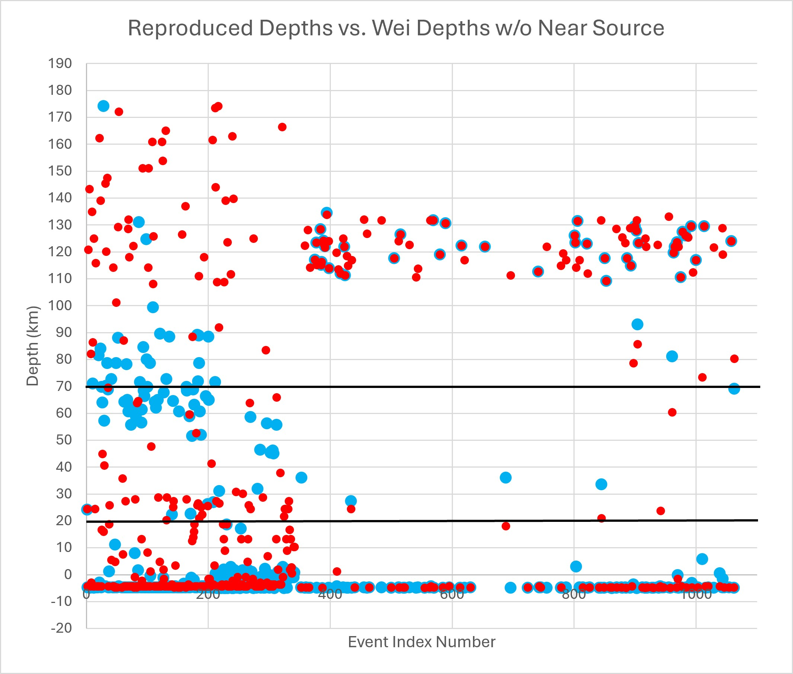
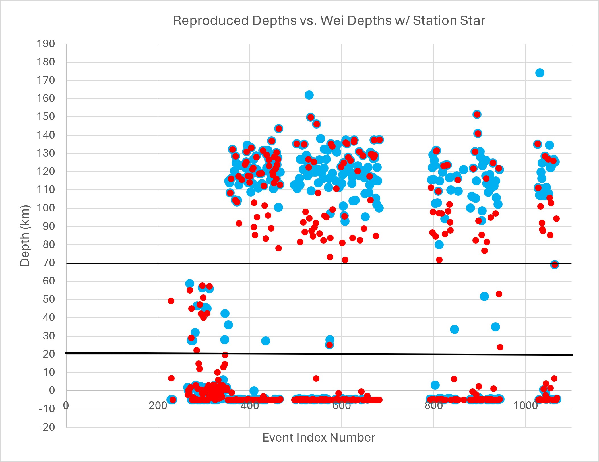
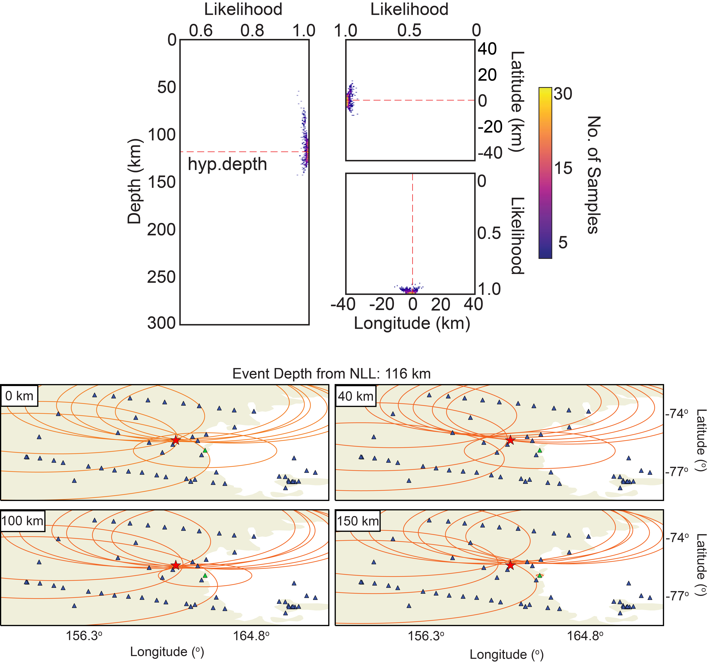
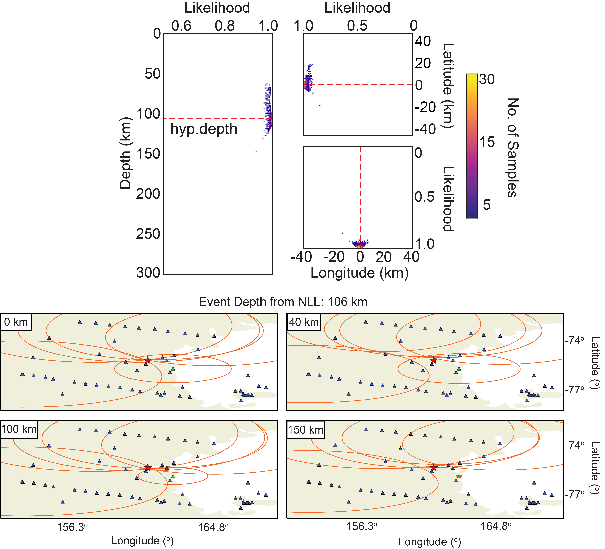
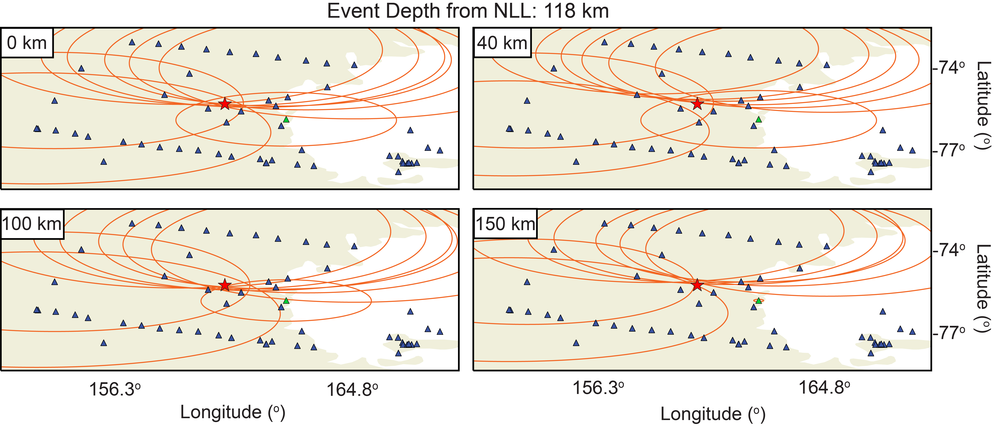
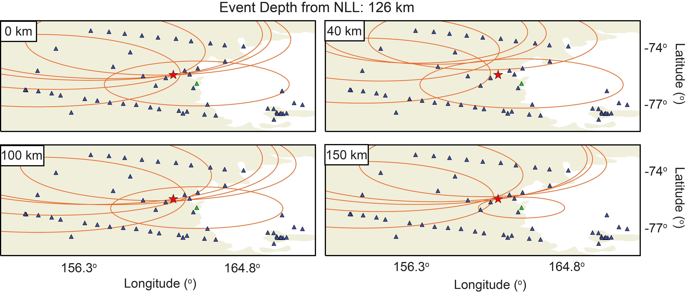
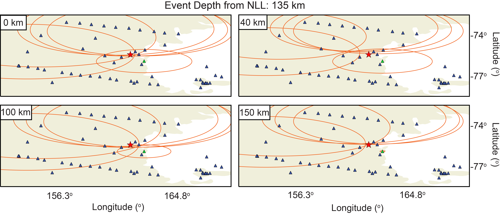

# Response to Wei's eLetter
## Long M. Ho1, José L. Sánchez-Roldán2, Samantha E. Hansen1, Jacob I. Walter3
### 1 Department of Geological Sciences, The University of Alabama; Tuscaloosa, AL 35487, USA. 
### 2 Department of Geodynamics, Stratigraphy and Paleontology, Complutense University of Madrid; Madrid, Spain. 
### 3 Oklahoma Geological Survey, The University of Oklahoma; Norman, OK 73019, USA.
In Ho et al. (1), we found intermediate depth earthquakes (IDEs) beneath David Glacier in East Antarctica. These events were relocated using NonLinLoc (NLL; 2) and a modified version of the 3D shear-wave velocity model from An et al. (3). We further validated the location of each event using an S-P arrival time assessment and an independent velocity model (4). In their eLetter, Wei questions whether the IDEs represent genuine upper-mantle seismicity or whether these are mislocated shallow icequakes. They suggest that the event depths vary with the distance to the nearest contributing seismic station and with temporal changes in station coverage, and they performed relocation tests that indicate the event depths change when nearby arrival-time picks are removed or when picks from station STAR are added. Based on these findings, Wei argues that the depth uncertainties were underestimated and that the seismic network geometry influenced our observations and conclusions. While Wei makes some valid points regarding the shortcomings of the available array geometry, which highlights the need for future field investigations, we argue that the majority of the IDEs beneath David Glacier are not the result of event mislocation.
  
One of Wei’s main arguments is that earthquake depths are more reliably constrained by nearby stations than by those located at far distances, given uncertainties associated with phase picking and three-dimensional Earth structure. They tested the importance of nearby stations by relocating the events without arrival times from stations within 100 km of each event. We have downloaded their resulting event catalog (catalog.csv from https://github.com/Wei-Xiaozhuo/response_to_Ho/tree/main/results), which is shown in Table A. The same column designations are maintained, but we have added an event index number to each earthquake. Since the events are ordered by origin time, a larger index number corresponds to a later event. In their eLetter, Wei notes that they were able to reproduce our depth distribution using the provided arrival-time dataset and velocity model. Their “Reproduced depths” are equivalent to those presented in our paper for all 1068 earthquakes in our catalog. The “Depth without near source” column presents the depths Wei acquired after relocating the events without the nearby arrival times (Table A). We note that Wei’s catalog contains 435 earthquakes that were relocated in this manner, not 353 as they report in their eLetter and as shown in their Figure 3. The 435 “Reproduced depths” with corresponding “Depth without near source” values are summarized in Table B, and these depths are plotted against our assigned event indices in Figure A. We reiterate that our event indices are assigned to specific events in the catalog, whereas Wei’s events appear to be sequentially numbered, as shown in their Figure 3.

Using the same definitions for shallow- and intermediate-depth events as that employed by Wei (i.e., < 20 km and > 70 km, respectively), the “Reproduced depths” (again, equivalent to our catalog) indicate 70 IDEs and 311 shallow events. Comparing these to the depths obtained with Wei’s “without near source” approach, 74% of the IDEs and 62% of the shallow events maintain their depth classifications. Following Wei’s relocation, 19% of the IDEs became shallow depth events, and 27% of the shallow events became IDEs (Table B). The percentage of events whose depths changed from one classification to the other are significantly smaller than that reported by Wei (i.e., 43% and 42%, respectively). It is also worth noting that if the absolute difference in event depths are determined between the two groups, 58% of the events have depth differences less than the uncertainty (&le; 20 km) reported in our paper (Table B).

We agree that excluding picks from nearby stations (within 100 km) does influence our results; however, during our analysis, only events with at least four P–S arrival-time pairs were permitted to relocate, which excludes the poorest-constrained events with insufficient phase observations. Wei does not include sufficient data to reproduce their relocations; thus, it is unclear how many P–S pairs remained for each event after they removed the near-source arrival times or whether they applied the same minimum-pair criterion we enforced. For an event initially constrained by four P–S pairs, removing even one pair would likely result in a less-constrained solution with increased depth uncertainty. All that said, even with these data removed, the vast majority of our events maintain their depth classification. Only a small percentage of the events (27%) switch from shallow depths to IDEs (or vice versa, 19%). Our reassessment of Wei’s “Depth without near source” values demonstrates that the impact of near-source arrival-time picks is not as substantial as they suggest, and the presence of IDEs beneath David Glacier is still supported.

Wei further notes the predominance of IDEs between 2013–2015 and argues that the temporal change in network geometry influences the inferred source depths. However, this assessment does not take into account the quality of seismic data nor the difference in network operation, both of which varied over the study period. For example, the TAMSEIS network, which operated between 2001-2003, only recorded seismic data during the austral summer; reduced power capabilities prevented recording during the Antarctic winter. This early deployment struggled somewhat to maintain operation in the extreme cold, and many stations experienced downtime, so data availability varies significantly from station to station (4, 5).  However, technological developments allowed the later TAMNNET deployment (2012-2015) to operate and record seismic data year-round, and the corresponding data recovery averaged 95% per field season (6). As such, our catalog includes significantly more data from the later time period. The larger number of IDEs identified during 2013-2015 is a result of data availability as opposed to network configuration or the lack of near-source arrival-time picks.

Wei also points out that we did not include station STAR, part of the Polar Seismic Italian Network (DY), in our analysis. We acknowledge that we missed this station since we focused on time periods when larger seismic networks were online. Station STAR had less than a month of operational overlap with the TAMSEIS deployment, and other DY stations within ~200 km of David Glacier did not overlap with TAMSEIS at all. Similarly, the nearby DY stations (other than station STAR) either only overlapped with TAMNNET for about a week at the end of 2015 or not at all. Wei added manual arrival-time picks from station STAR for 450 earthquakes in our catalog, relocated the events again, and their corresponding “Depth with STAR” values are summarized in Table A. Similar to Table B, we have compiled the “Reproduced depths” for these 450 examined events with their corresponding “Depth with STAR” values in Table C.  Both groups are plotted in Figure B, where the depths are again plotted against our assigned event indices. The “Reproduced depths” (again, equivalent to our catalog) indicate 178 shallow events and 252 IDEs. Following Wei’s relocation employing data from station STAR, 87% of the shallow events maintain their depth classification, with 8% instead becoming IDEs. As Wei reports, more IDEs relocate to shallow depths following their relocation; however, more than half (51%) maintain their depth classification. Even Wei’s relocated catalog indicates 146 IDEs (Table C; note: they only indicate 70 IDEs in their eLetter). Further, if the absolute difference in event depths are determined between the two groups, 57% of the events have depth differences less than the uncertainty ( 20 km) reported in our paper.

Several methodological details needed to fully assess Wei’s relocations incorporating station STAR are neither included in their eLetter nor their archived materials. For example, Wei does not describe how their manual picks were associated with earthquakes in our catalog. Depending on the approach taken, this could introduce additional misfit during their relocation. They also do not provide their NLL input file nor individual PDF results. These materials would allow us to determine whether equivalent relocation parameters were employed in their analysis and whether their alternative locations are well constrained. 

Nevertheless, to address these potential discrepancies in analysis, we performed our own NLL relocation to evaluate the influence of station STAR. We associated Wei’s manual picks with our earthquakes by matching each pick to the event with the nearest origin time. We then relocated these events using the same procedure described in Ho et al. (1) and compared our results with Wei’s relocated catalog (Table C). We identified 87 IDEs that Wei’s results relocated to shallow depths but that retained their intermediate depths when relocated using our parameters (Table D). We further evaluated these locations using their NLL PDFs, and examples are shown in Figures C and D. When Wei’s travel-time picks from station STAR are incorporated into our NLL relocation procedure, the two example events relocate to depths of 116 and 106 km, respectively, which are comparable to their depths in our original catalog (116 and 105 km, respectively). However, in Wei’s relocated catalog, both of these events are reported as having depths of −5 km. These new results show that when using the same relocation procedure, many “shallow” earthquakes reported in Wei’s catalog retain their intermediate depths, as reported in our catalog. 

Even if the difference in NLL parameterization is disregarded, Wei’s catalog still includes 146 IDEs (Table C). They suggest that these may result from arrival time down-weighting in NLL, where pick times from station STAR were not as strongly considered given their large misfits. This is another instance where having Wei’s full location dataset would be useful to ascertain the discrepancy. However, we reiterate that our event depths were further validated with an independent S-P arrival time assessment (Fig. 2 and Figs. S2-S8) to confirm whether the observed differential times were consistent with the estimated source depths. Such comparisons provide a standard approach to assess earthquake depth and have been used in previous studies to provide an independent test of earthquake location (e.g., 7, 8). This method is not influenced by arrival time down-weighting. We employed this approach - incorporating Wei’s S-P times from station STAR - to further evaluate the events that shallowed in their results but that retained their IDE depth classification in our updated NLL relocation (Figs. C and D; Table D). We also applied this assessment to the IDEs reported in Wei’s relocated catalog (Figs. E-G). In all cases, the differential S–P times, including those from station STAR, are consistent with the reported IDE depths. This further emphasizes the robustness of our conclusions and demonstrates that the IDEs are not a result of down-weighting arrival times from near-source stations.

Ultimately, both our study and Wei’s eLetter support the need for increased station density across Antarctica in order to better understand the seismic nature of the continent. While we acknowledge that some of the IDEs identified in our paper could be mislocated and actually be related to shallow cryospheric processes, we maintain that the bulk of our observations are not consistent with this interpretation, as emphasized by both our NLL relocations and S-P arrival time assessment.

**Figure A.** Comparison of the “Reproduced depths” (blue circles) and the depths after removing arrival-time picks within 100 km of each event (red circles) for the 435 earthquakes common to both datasets. Event index numbers were assigned according to origin time, with larger index numbers corresponding to later events. Horizontal black lines indicate the depth thresholds used to classify shallow earthquakes (<20 km) and intermediate-depth earthquakes (>70 km). The blue circles are plotted slightly larger so that they remain visible beneath overlapping red circles.

**Figure B.** Comparison of the “Reproduced depths” (blue circles) and the depths obtained by Wei after incorporating manual arrival-time picks from station STAR (red circles) for the 450 earthquakes common to both datasets. Event index numbers and depth thresholds are the same as those shown in Figure A.

**Figure C.** Example of earthquake relocation assessment for an event that occurred at 21:00:55 on 07 January 2014, taking arrival-times from station STAR into account. (top) PDFs for the vertical and horizontal components from NLL. The dashed red lines indicate the calculated hypocentral depth (116 km) and relative location. The color scale shows how many samples fall within each 1-km interval, with each sample representing a possible event location on the basis of the arrival-time data. (bottom) Spatially mapped S–P travel times (orange circles) for tested source depths of 0, 40, 100, and 150 km. The radius of each circle indicates the corresponding S–P time for a particular station. On each panel, the blue triangles indicate station locations, but station STAR is indicated by a green triangle. The red star indicates the NLL event epicenter.

**Figure D.** Same as Figure C but now for an IDE that occurred 21:26:11 on 07 March 2015. Including the travel-time picks from station STAR, NLL indicates a hypocentral depth of 106 km, which is also supported by our independent S-P arrival time assessment.

**Figure E.** Example S-P arrival time assessment for an event that occurred at 19:21:21 on 03 February 2015. Spatially mapped S–P travel times (orange circles) were tested for source depths of 0, 40, 100, and 150 km, where the radius of each circle indicates the corresponding S–P time for a particular station. On each panel, the blue triangles indicate station locations, but station STAR is highlighted by the green triangle.  The red star indicates our original NLL event epicenter, which has a depth of 118 km. Wei’s reported depth for this event was 116 km.

**Figure F.** Same as Figure E but now for an event that occurred at 03:18:02 on 11 April 2015. Wei's reported event depth (116 km), which incorporates travel-time data from station STAR, is similar to that reported in our original catalog (126 km).

**Figure G.** Same as Figure E but now for an event that occurred at 03:05:20 on 15 April 2014. Wei's reported event depth (104 km), which incorporates travel-time data from station STAR, is similar to that reported in our original catalog (135 km).

[**Table A.**](Tables/Table_A.csv) Wei’s catalog with added event index numbers.

[**Table B.**](Tables/Table_B.csv) Comparison of the “Reproduced depths” and Wei’s “Depth without near source” values for 435 common earthquakes.

[**Table C.**](Tables/Table_C.csv) Comparison of earthquake depths for events relocated with arrival-time picks from station STAR.

[**Table D.**](Tables/Table_D.csv) Events with different depth classifications between our latest relocation and Wei’s relocation incorporating station STAR.
